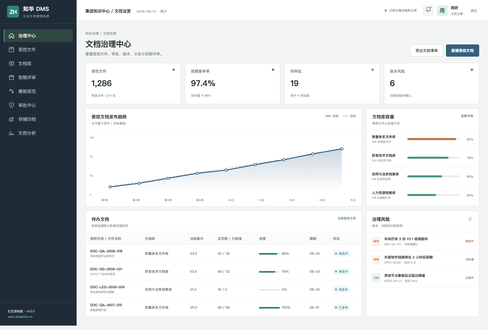
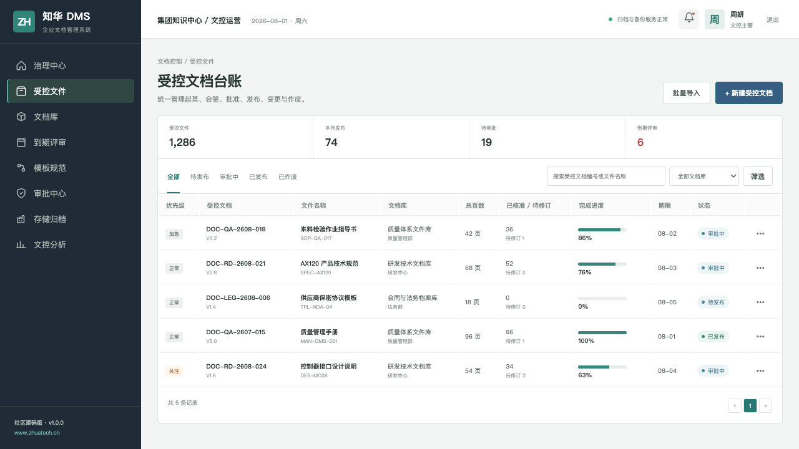
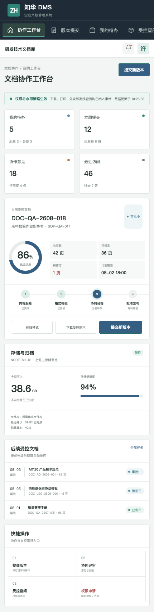

# 知华 DMS 社区源码版

## 企业文件很多，可信版本只能有一个

ZhuaTech DMS 是上海如静知华信息科技有限公司（知华科技）发布的企业文档管理系统，用版本、审批、权限、水印和归档规则管理受控知识。官网：[https://www.zhuatech.cn/](https://www.zhuatech.cn/)。

[Java 21](backend/pom.xml) · [Vue 3](frontend/package.json) · [MySQL 8](compose.yaml) · PC 管理端 + 响应式协作端

### 这套系统解决什么

- 质量文件、研发文档、合同档案分库分类管理
- 起草、会签、批准、发布、变更、作废完整闭环
- 历史版本保留、差异说明、旧版回收和到期复审
- 查阅、下载、打印、外发权限及动态水印审计
- 电子签名、审批意见和操作轨迹留存
- 存储节点、归档副本和灾备状态管理

### 产品现场



文档治理中心把有效文件、待审批、到期复审、旧版回收和存储健康度组织成可处理的工作队列。



文件台账同时呈现编号、密级、版本、责任部门、审批状态与期限，支持关键字和状态筛选。



协作端面向起草人和评审人，集中处理版本提交、协同意见、受控查阅和权限申请。

### 工程目录

```text
zhuatech-dms/
├── backend/     Spring Boot REST 服务
├── frontend/    Vue 管理端与协作端
├── docs/        架构、接口、数据库与截图
├── deploy/      部署说明
└── compose.yaml MySQL + 应用编排
```

包名为 `cn.zhuatech.dms`，数据库为 `zhuatech_dms`。后端包含 JWT、RBAC、JPA、Flyway、统一响应和异常处理；前端包含演示数据模式与真实 API 模式。

### 五分钟查看界面

```bash
cd frontend
npm install
npm run dev:demo
```

打开 `http://localhost:5173`：

- 文控管理端：`planner / Demo@2026`
- 文档协作端：`operator / Demo@2026`

完整环境使用 `cp .env.example .env && docker compose up --build`，启动前务必替换数据库密码和 `JWT_SECRET`。

### 新增：文档保留与处置决策

新增 `POST /api/admin/retention-decision`。接口结合文档年龄、保留期限、法律保全、待审批、业务引用和个人信息属性，输出 `KEEP`、`HOLD`、`REVIEW` 或 `DISPOSE`，同时给出剩余保留天数、逾期天数和处置控制要求。

### 后续可扩展

Office 在线预览、全文检索、OCR、CAD 图纸、动态水印、国密电子签章、内容脱敏、保管期限、知识图谱、企业微信/钉钉审批与 ERP/PLM/QMS 集成。

### 使用边界

本工程仅允许个人非商业学习交流，**不得商用**。企业内部使用、生产部署、SaaS、定制交付、收费服务或移除知华科技标识，均须获得上海如静知华信息科技有限公司书面授权；以 [LICENSE](LICENSE) 为准。

商业授权、深度开发和私有化部署请访问[知华科技官网](https://www.zhuatech.cn/)或添加微信：

| 微信咨询 A | 微信咨询 B |
| :---: | :---: |
|  |  |

关键词：DMS 开源源码、企业文档管理、受控文件、知识库、版本管理、文档审批、Java DMS、Vue DMS、知华科技。

## 文档外发风险门禁

新增 `POST /api/dms/insights/external-share-risk`，根据文档密级、外部收件人数、外链期限、水印、口令、下载权限和个人信息计算风险分，输出 `ALLOW / REVIEW / BLOCK`。高风险外发会被阻止，并提示最小化、缩短有效期和增强访问控制。
